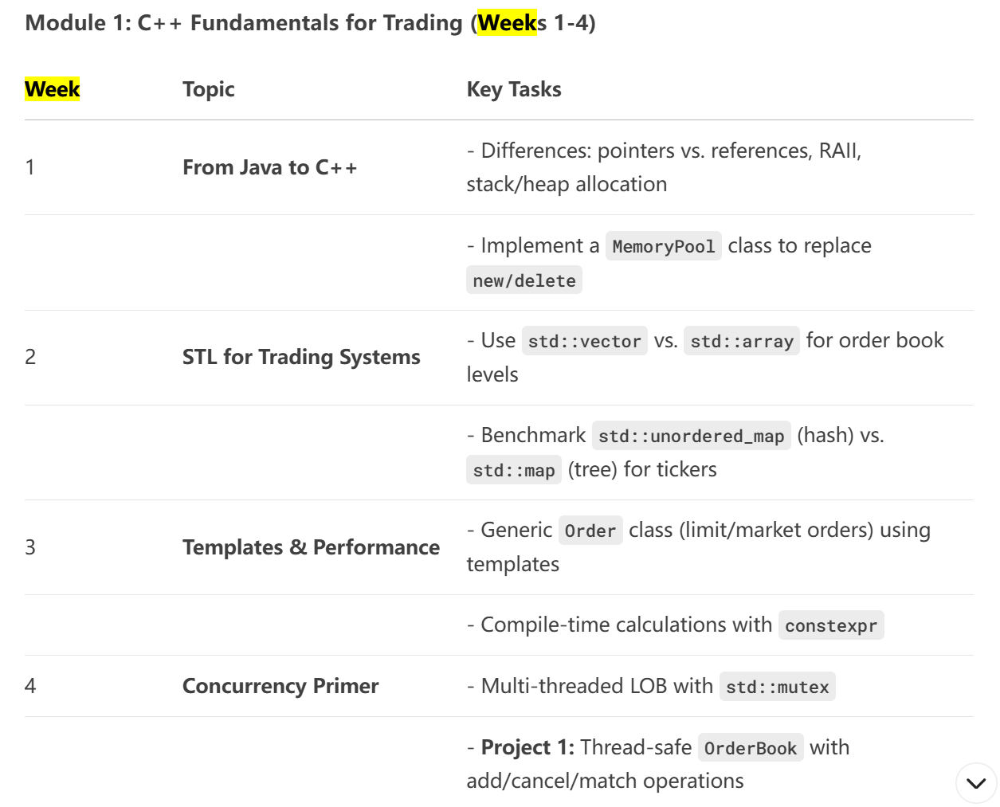
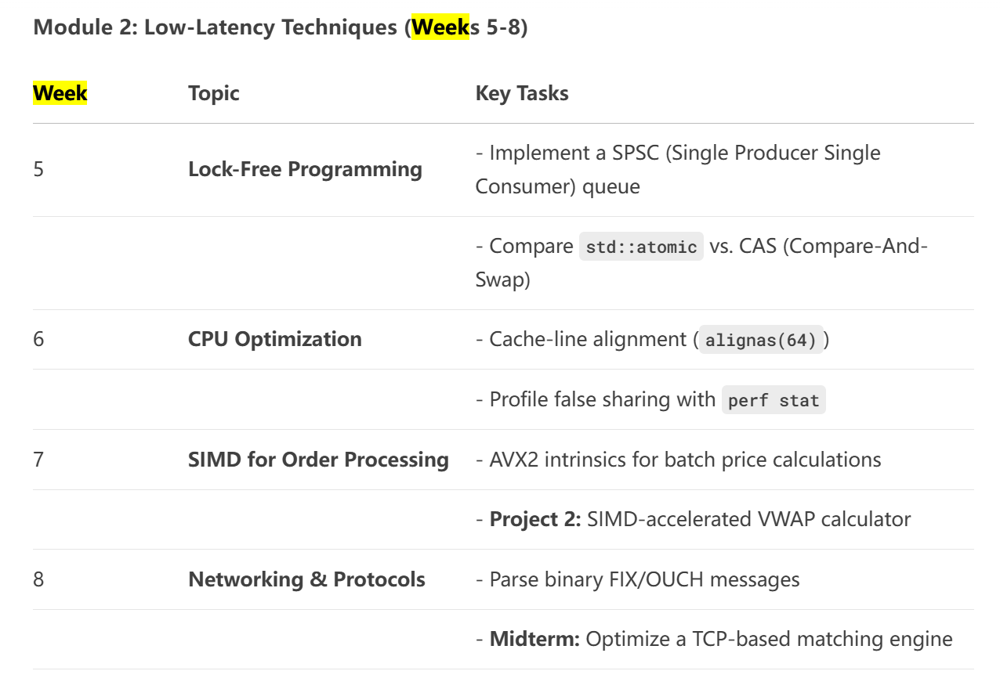
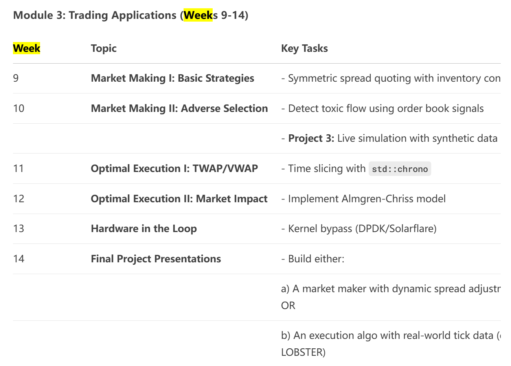

# cpp_trading

这是Hanxiao Zhu的C++学习进度笔记。

学习思路：
    1. 菜鸟教程：https://www.runoob.com/cplusplus/cpp-tutorial.html
    2. 进阶教程：https://www.learncpp.com/
    3. 核心构件：DeepSeek Syllabus
        
        
        

WSL基础命令

    1. 编译(f5)
        cd ~/cpp_trading/build
        make
        ./hello_cmake
        
    2. Git版本管理-项目地址：https://github.com/675401943/cpp-learning.git
        git branch                       # 0. 分支查看
        git status                       # 0. 状态查看
        git add .                        # 1. 添加所有更改文件（或指定文件）
        git commit -m "更新说明"          # 2. 提交更改到本地仓库
        git push origin main             # 3. 推送更改到 GitHub（远程）
    

核心概念

    1. 内存管理
        指针（*）：直接操作内存地址，高频交易中常用于零拷贝数据处理。
        引用（&）：安全的别名机制，避免拷贝开销。
        手动内存分配：new/delete（高频交易中可能自定义内存池优化性能）。

    2. 对象生命周期控制
        RAII（资源获取即初始化）：通过构造函数/析构函数管理资源（如文件句柄、锁），避免Java的GC不确定性。
        移动语义（std::move）：避免深拷贝，提升性能。

    3. 模板与泛型编程
        模板（template）：编译期多态（Java泛型是擦除式），高频交易中用于编写高性能通用容器/算法。
        STL（标准模板库）：如std::vector、std::unordered_map，需理解其底层实现（如哈希表冲突处理）。

    4. 低层级操作
        位操作：直接操作二进制数据（如协议解析）。
        对齐控制（alignas）：优化CPU缓存行访问。

    5. 并发与系统交互
        多线程（std::thread）：比Java更接近操作系统原语。
        原子操作（std::atomic）：无锁数据结构的基础。
        系统调用：如mmap直接映射内存。

To-do List:

    1. Git Hub
        .gitignore
        因为build文件夹的内容可以在其他电脑上重新生成 因此让Git忽略
        当我学习到一定阶段，我将开始探索GitHub的使用。

    2. 工作流：CMake configure 是为了生成构建系统，build 才是实际编译
        第一次构建：
            mkdir build && cd build
            cmake ..         # ← Configure
            cmake --build .  # ← Build
        新建文件：
            建议放在src（即source）源代码文件夹下
            修改CMakeList.txt的add_executable
            Configure   # 修改了构建系统
            Build       # 修改了代码.cpp or .h

    3. 学习指南位于DeepSeek专门的chat
        设计模式
            总体来说设计模式分为三大类：
                1 创建型模式，共五种：工厂方法模式、抽象工厂模式、单例模式、建造者模式、原型模式。
                2 结构型模式，共七种：适配器模式、装饰器模式、代理模式、外观模式、桥接模式、组合模式、享元模式。
                3 行为型模式，共十一种：策略模式、模板方法模式、观察者模式、迭代子模式、责任链模式、命令模式、备忘录模式、状态模式、访问者模式、中介者模式、解释器模式。
            利用 C++实现这些设计模式并牢记于心重中之重。

## 📁 项目结构

